# 🌱 Uplift — Emotional Support Platform

> A peer-based emotional support platform connecting people through shared experiences.

Uplift helps individuals find others who truly understand their struggles by matching them based on real-life experiences — creating meaningful, human connections.

---

## 🚀 Features

* 🔐 Secure Authentication (Login / Signup)
* 👤 Personalized Profiles
* 🔍 Experience-Based Matching
* 💬 Real-Time Chat System
* 🧑‍🤝‍🧑 Community Creation & Participation
* 📖 Share & Explore Real Stories
* 🧠 Peer Support Sessions
* 🚨 Moderation & Admin Controls

---

## 📸 Screenshots

### 🔐 Authentication

#### Signup

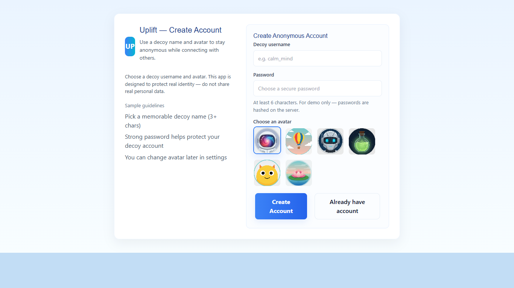

#### Login

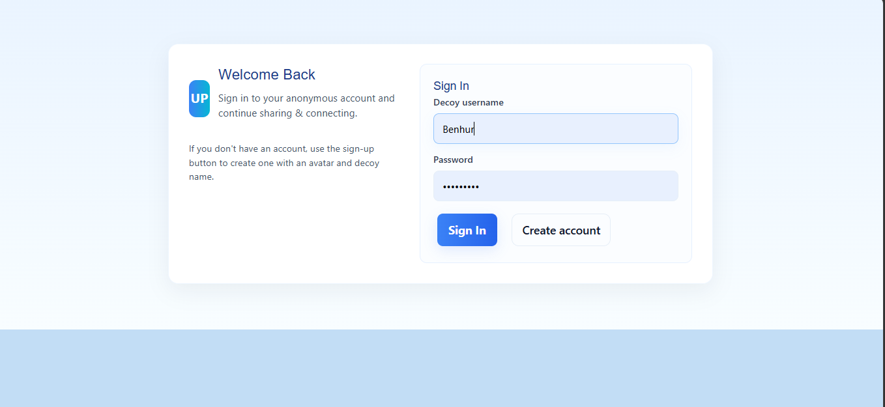

---

### 🏠 Main Experience

#### Home Screen

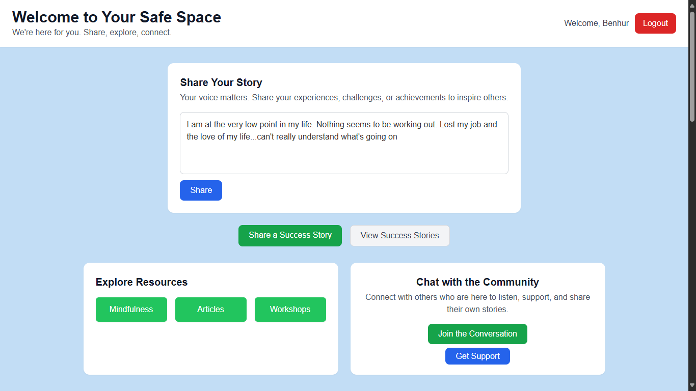

#### Results / Matching

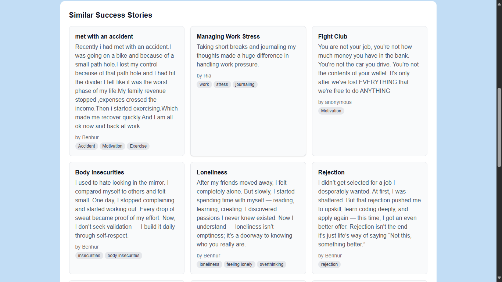

#### View Similar Stories

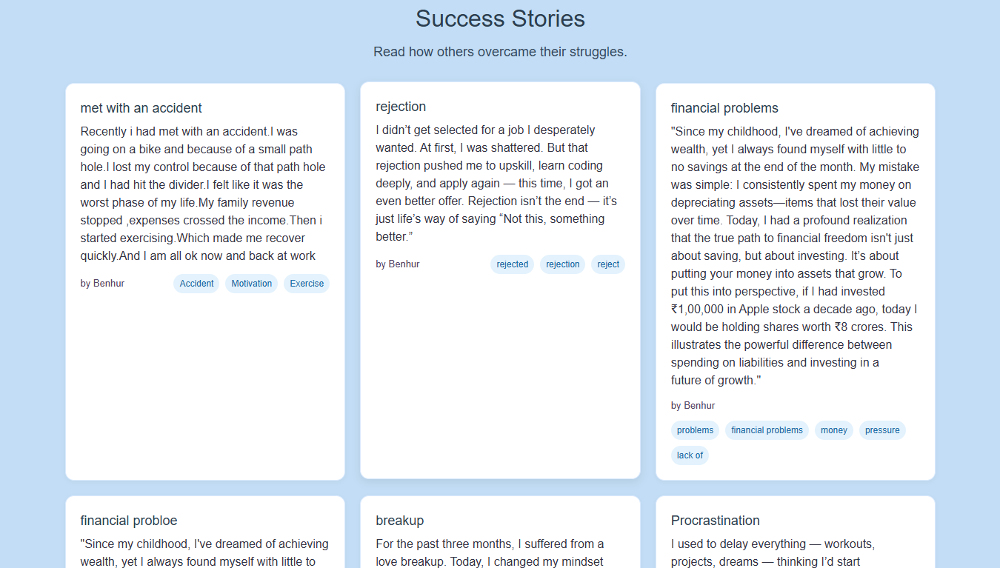

#### Explore Communities

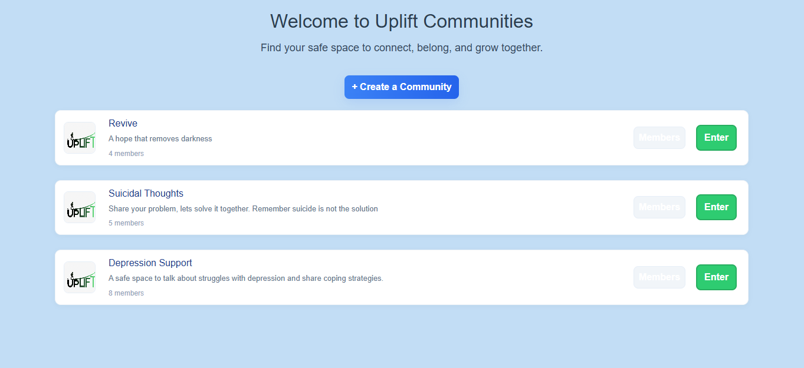

---

### 💬 Interaction & Support

#### Community Chat

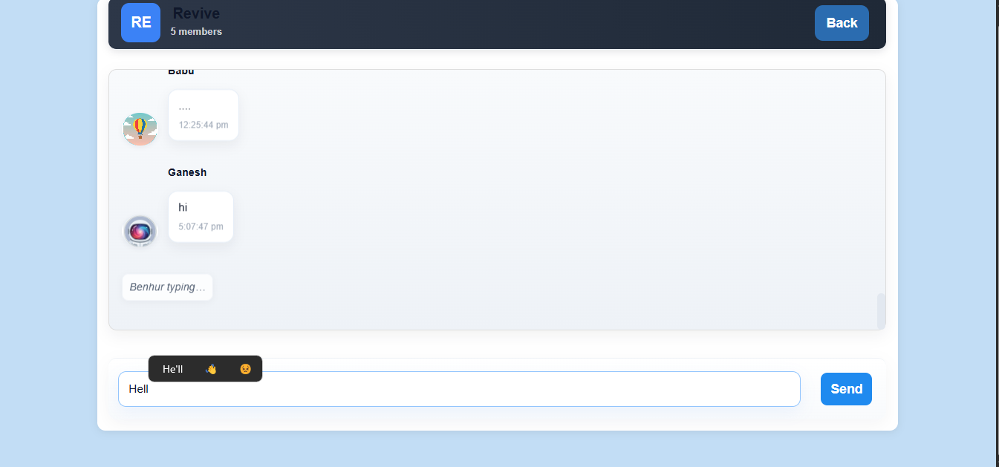

#### Support Session

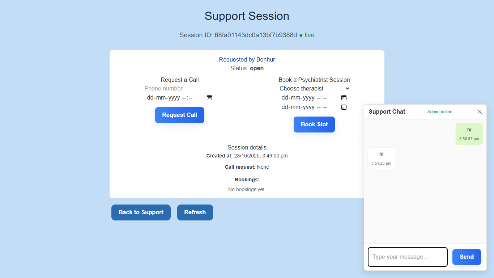

---

### ✍️ Content Creation

#### Create Communities

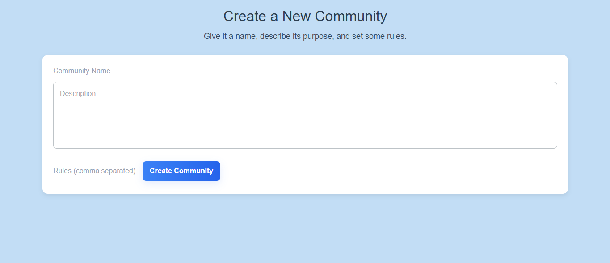

#### Share Success Story

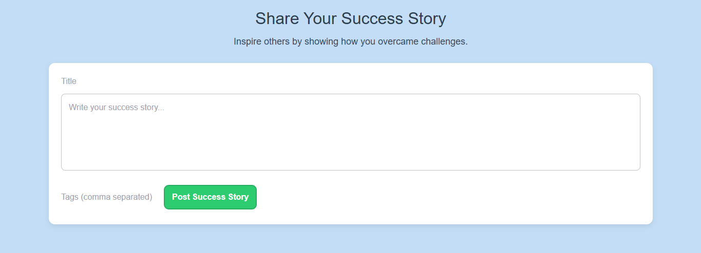

---

### 🧰 Additional Features

#### Resources Section

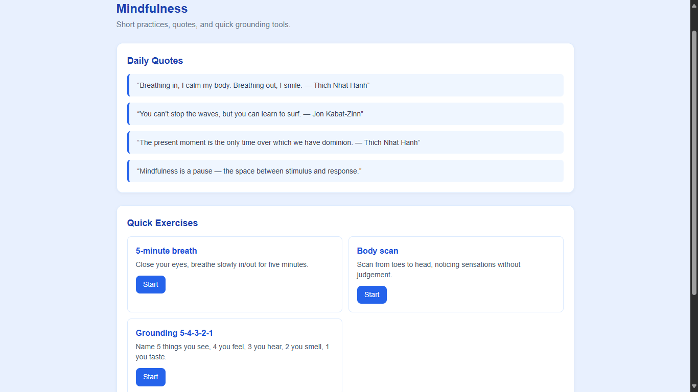

---

### 🛠️ Admin Panel

#### Admin Interface

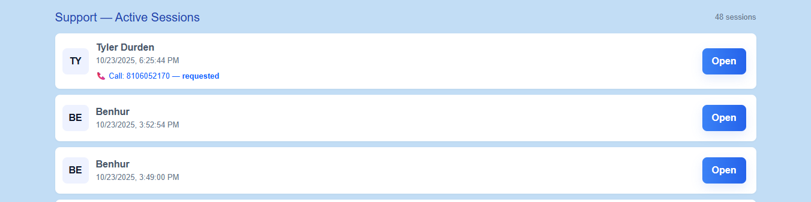

---

## 🧠 Problem It Solves

Many people struggle emotionally but don’t feel comfortable opening up to professionals or strangers who don’t understand them.

Uplift solves this by:

* Connecting users with people who’ve had similar experiences
* Creating a safe space for meaningful conversations
* Encouraging peer-based emotional support

---

## 🏗️ Tech Stack

**Frontend**

* React

**Backend**

* Node.js + Express

**Database**

* MongoDB → MongoDB Atlas

**Real-Time**

* Socket.IO / WebSockets

**Storage**

* AWS S3 (or similar)

**Tools**

* MongoDB Compass
* Postman
* Git & GitHub

---

## 📁 Project Structure

```
uplift/
├── uplift-backend/    
├── uplift-frontend/   
├── screenshots/       
├── structure.txt
└── README.md
```

---

## ⚙️ Installation & Setup

### 1. Clone the repository

```bash
git clone https://github.com/Benhur167/uplift.git
cd uplift
```

---

### 2. Backend Setup

```bash
cd uplift-backend
npm install
```

Create `.env` file:

```
PORT=3000
MONGODB_URI=your_mongodb_atlas_connection_string
JWT_SECRET=your_secret_key
```

Run backend:

```bash
npm start
```

---

### 3. Frontend Setup

```bash
cd uplift-frontend
npm install
npm start
```

---

## 🗄️ Database Setup

### Dump local database

```bash
mongodump --uri="mongodb://localhost:27017/uplift" --archive="uplift_backup.archive" --gzip
```

### Restore to Atlas

```bash
mongorestore --uri="your_atlas_connection_string" --archive="uplift_backup.archive" --gzip
```

---

## 📡 API Overview

| Method | Endpoint               | Description    |
| ------ | ---------------------- | -------------- |
| POST   | /api/auth/register     | Register user  |
| POST   | /api/auth/login        | Login user     |
| GET    | /api/users/:id         | Get profile    |
| PUT    | /api/users/:id         | Update profile |
| GET    | /api/match             | Find matches   |
| POST   | /api/connections       | Send request   |
| GET    | /api/conversations/:id | Get messages   |
| POST   | /api/messages          | Send message   |
| POST   | /api/reports           | Report content |

---

## 🔐 Security

* Password hashing (bcrypt)
* JWT-based authentication
* Input validation & sanitization
* Role-based moderation system

---

## 🧪 Testing

```bash
npm test
```

---

## 📈 Future Improvements

* AI-based emotional matching
* Anonymous support mode
* Voice/video sessions
* Mobile app deployment
* Smart moderation system

---

## 🤝 Contributing

Feel free to fork the repo and submit pull requests.

---

## 📄 License

MIT License

---

## 🙌 Acknowledgment

Built to create a space where people feel heard, understood, and supported.

---
